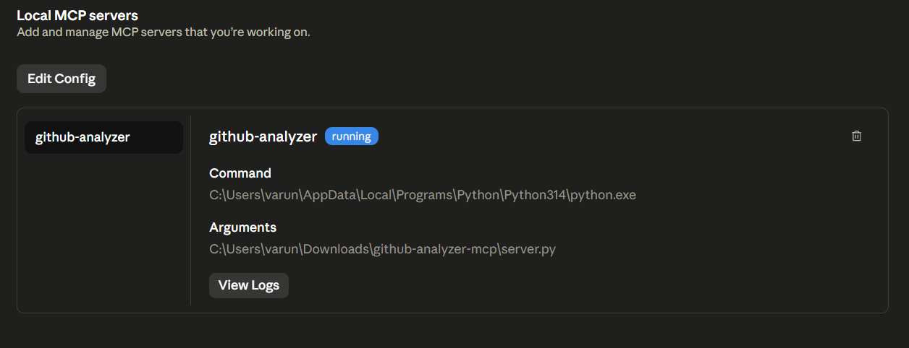
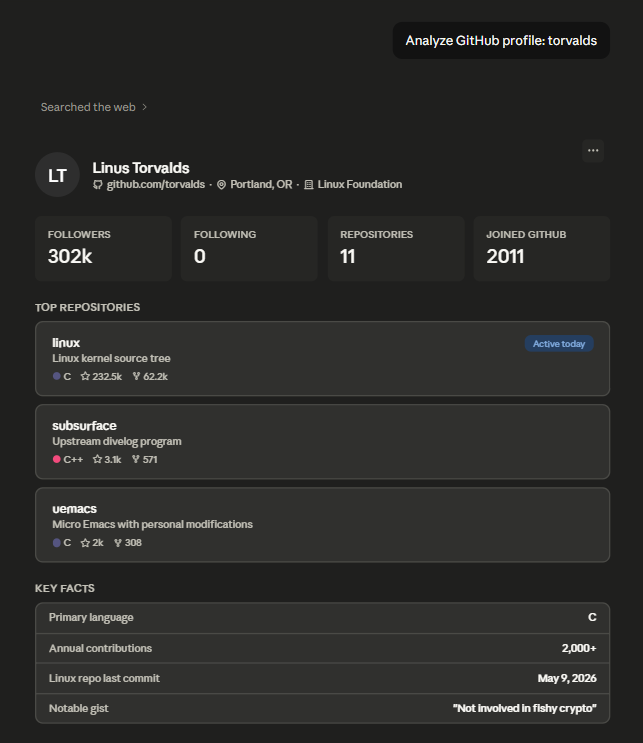
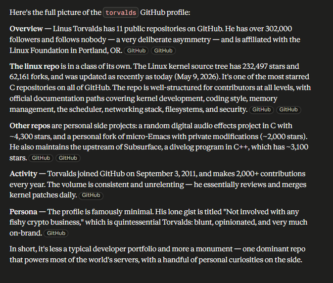
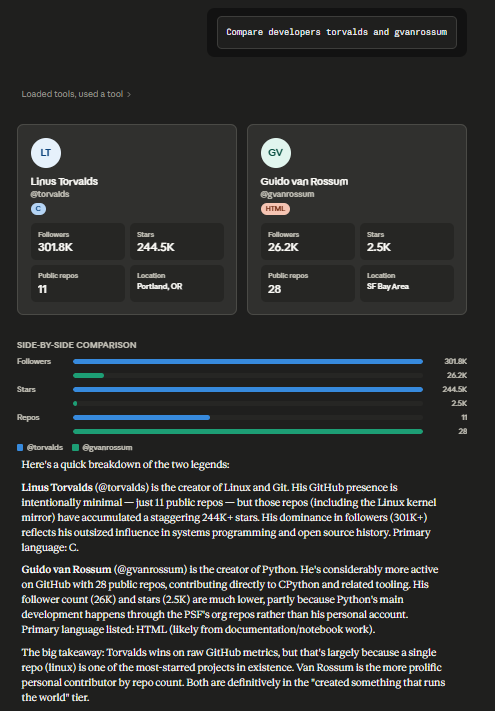
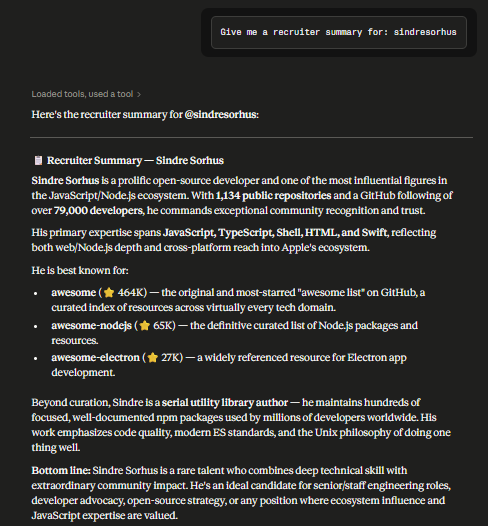
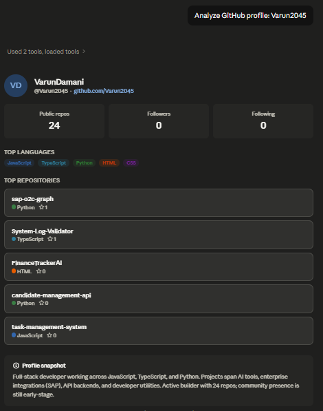
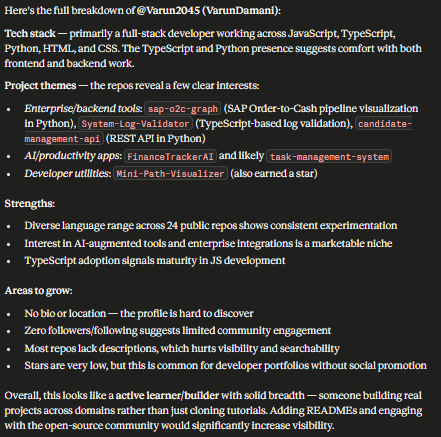

# 🔍 GitHub Portfolio Analyzer — MCP Server

An MCP (Model Context Protocol) server that lets Claude AI analyze 
GitHub profiles and generate recruiter-ready developer summaries.

## 🚀 What It Does

Ask Claude things like:
- *"Analyze the GitHub profile of torvalds"*
- *"Compare developers gvanrossum and dhh"*  
- *"Give me a recruiter summary for sindresorhus"*

## 🛠️ Tech Stack

- Python 3.10+
- [MCP SDK](https://github.com/anthropics/mcp) by Anthropic
- GitHub REST API v3
- httpx (async HTTP)
- Claude Desktop (host)

## ⚙️ Setup

1. Clone the repo
```bash
   git clone https://github.com/YOUR_USERNAME/github-analyzer-mcp
   cd github-analyzer-mcp
```

2. Install dependencies
```bash
   pip install -r requirements.txt
```

3. Add your GitHub token
```bash
   cp .env.example .env
   # Edit .env and add your GITHUB_TOKEN
```

4. Add to Claude Desktop config
```json
   {
     "mcpServers": {
       "github-analyzer": {
         "command": "python",
         "args": ["C:\\path\\to\\server.py"]
       }
     }
   }
```

5. Restart Claude Desktop and start analyzing!

## 🔧 Available Tools

| Tool | Description |
|------|-------------|
| `analyze_github_profile` | Full profile breakdown with top repos & languages |
| `compare_two_developers` | Side-by-side comparison table |
| `get_recruiter_summary` | Polished paragraph for hiring decisions |

## 📸 Demo

### ✅ MCP Server Connected & Running


### 🔍 Analyzing Linus Torvalds' Profile



### ⚖️ Comparing Two Developers


### 📋 Recruiter Summary Output


### 👤 Analyzing My Own Profile



## 📄 License
MIT
